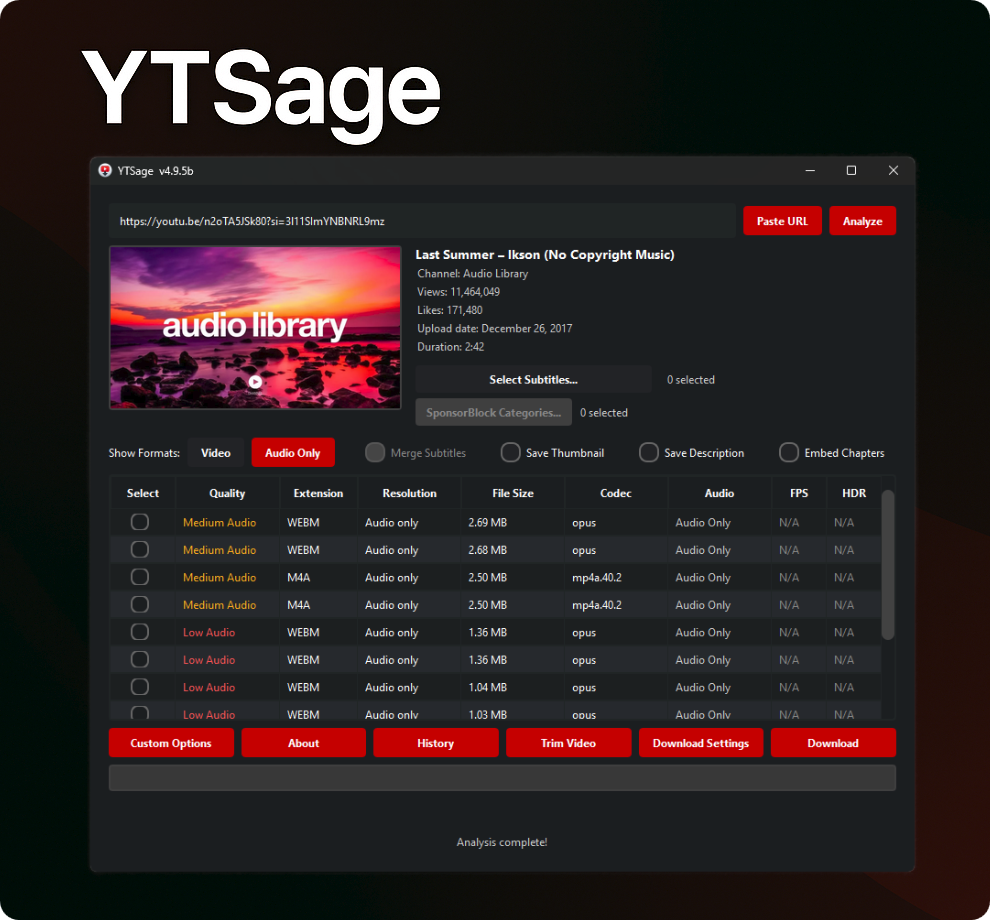

<div align="center">


[](https://www.python.org/downloads/)
[](https://pepy.tech/project/ytsage)
[](https://github.com/oop7/YTSage/releases)
[](https://opensource.org/licenses/MIT)
[](https://github.com/oop7/YTSage/releases)
[](https://github.com/oop7/YTSage/stargazers)
[](https://pypi.org/project/ytsage/)
[](https://github.com/sponsors/oop7)

**Un téléchargeur YouTube moderne avec une interface PySide6 épurée.**  
Téléchargez des vidéos dans n'importe quelle qualité, extrayez l'audio, récupérez les sous-titres, et plus encore.

### 🌍 Langues du README

Anglais : [EN](../README.md)
| Arabe : [AR](README.ar.md)
| Allemand : [DE](README.de.md)
| Espagnol : [ES](README.es.md)
| Français : [FR](README.fr.md)
| Hindi : [HI](README.hi.md)
| Indonésien : [ID](README.id.md)
| Italien : [IT](README.it.md)
| Japonais : [JA](README.ja.md)
| Polonais : [PL](README.pl.md)
| Portugais : [PT](README.pt.md)
| Russe : [RU](README.ru.md)
| Turc : [TR](README.tr.md)
| Chinois : [ZH](README.zh.md)

<p align="center">
  <a href="#installation">Installation</a> •
  <a href="#features">Fonctionnalités</a> •
  <a href="#usage">Utilisation</a> •
  <a href="#screenshots">Captures d'écran</a> •
  <a href="#troubleshooting">Dépannage</a> •
  <a href="#sponsor">Sponsor</a> •
  <a href="#contributing">Contribution</a>
</p>

</div>

---

<a id="why-ytsage"></a>
## ❓ Pourquoi YTSage ?

YTSage est conçu pour les utilisateurs qui recherchent un **téléchargeur YouTube simple mais puissant**. Contrairement à d'autres outils, il offre :

- Une interface PySide6 moderne et épurée
- Téléchargements en un clic pour la vidéo, l'audio et les sous-titres
- Fonctionnalités avancées comme SponsorBlock, la fusion des sous-titres et la sélection de playlists
- Mode générique (Generic Mode) optionnel pour les sites pris en charge par yt-dlp au-delà de YouTube
- Support multiplateforme et installation facile

<a id="features"></a>
## ✨ Fonctionnalités

<div align="center">

| Fonctionnalités de base | Fonctionnalités avancées | Fonctionnalités supplémentaires |
|-----------------------------------|-----------------------------------------|------------------------------------|
| 🎥 Tableau des formats | 🚫 Intégration de SponsorBlock | 🎞️ Affichage FPS/HDR |
| 🎵 Extraction audio | 📝 Sélection et fusion de sous-titres | 🔄 Mise à jour automatique de yt-dlp |
| ✨ Interface utilisateur simple | 💾 Enregistrement de la description et de la miniature | 🛠️ Détection de FFmpeg/yt-dlp/Deno |
| 📋 Support et sélecteur de playlists | 🚀 Limiteur de vitesse | ⚙️ Commandes personnalisées |
| 📑 Intégration des chapitres | ✂️ Découpage de sections vidéo | 🍪 Connexion avec Cookies |
| 📜 Historique des téléchargements | 🔄 Sélection du canal de version | 🌐 Support Proxy |
| 🎚️ Conversion du format audio | 🎬 Paramètres de format vidéo | 🆙 Onglet de mise à jour intégré |
| 🌍 Mode générique | 🔊 Normalisation audio (EBU R128) | 🌍 Localisation en 14 langues |
| 💾 Exportation de playlists | ⚙️ Qualité et sous-titres par défaut | |
</div>

<a id="installation"></a>
## 🚀 Installation

### ⚡ Installation rapide (Recommandé)

Installez YTSage via PyPI :

```bash
pip install ytsage
```

<details>
<summary>🔄 Mettre à jour une installation existante</summary>

```bash
pip install --upgrade ytsage
```

</details>

Lancez ensuite l'application :

```bash
ytsage
```

### 📦 Exécutables pré-construits

> [👉 Télécharger la dernière version](https://github.com/oop7/YTSage/releases/latest)

#### 🪟 Windows

| Format | Description |
|--------|-------------|
|  | Installateur standard |
|  | Avec FFmpeg inclus |
|  | Version portable, aucune installation requise |
|  | Portable avec FFmpeg, zippé |

<details>
<summary>🛠️ Étapes d'installation</summary>

1. **Installateur EXE (`.exe`)** : Double-cliquez sur le fichier et suivez l'assistant de configuration.
2. **Version portable (`.zip`)** : Extrayez l'archive vers l'emplacement souhaité et lancez `ytsage.exe`.
3. **FFmpeg inclus** : Choisissez les versions avec FFmpeg inclus si vous n'avez pas FFmpeg installé sur votre système.
</details>

#### 🐧 Linux

| Format | Description |
|--------|-------------|
|  | Paquet Debian |
|  | AppImage, portable |
|  | Paquet RPM |
|  | Flatpak Bundle |

<details>
<summary>🛠️ Étapes d'installation</summary>

- **DEB (`.deb`)** :
  ```bash
  sudo dpkg -i ytsage_*.deb
  sudo apt-get install -f # Répare les dépendances manquantes si nécessaire
  ```
- **RPM (`.rpm`)** :
  ```bash
  sudo rpm -i ytsage-*.rpm
  ```
- **AppImage (`.AppImage`)** :
  ```bash
  chmod +x YTSage-*.AppImage
  ./YTSage-*.AppImage
  ```
- **Flatpak** : Suivez les instructions sur Flathub ou lancez :
  ```bash
  flatpak install flathub io.github.oop7.ytsage
  ```
</details>

#### 🍎 macOS

| Format | Description |
|--------|-------------|
|  | Application zippée pour Apple Silicon |
|  | Installateur d'image disque pour Apple Silicon |

<details>
<summary>🛠️ Étapes d'installation</summary>

- **Installateur DMG (`.dmg`)** : Double-cliquez pour monter, puis faites glisser `YTSage.app` dans votre dossier Applications.
- **Archive d'application (`.zip`)** : Extrayez le zip et déplacez `YTSage.app` dans votre dossier Applications.

*Note : Si vous rencontrez une erreur "L'application est endommagée", consultez la section de dépannage macOS ci-dessous.*
</details>

---

<details>
<summary>💻 Installation manuelle à partir des sources</summary>

### 1. Cloner le dépôt

```bash
git clone https://github.com/oop7/YTSage.git
cd YTSage
```

### 2. Installer les dépendances

#### ⚡ Avec uv

```bash
uv pip install .
```

#### 📦 Ou avec pip standard

```bash
pip install .
```

### 3. Lancer l'application

```bash
python -m ytsage.main
```

</details>

<a id="screenshots"></a>
## 📸 Captures d'écran

<div align="center">
<table>
  <tr>
    <td></td>
    <td></td>
  </tr>
  <tr>
    <td align="center"><em>Paramètres de téléchargement</em></td>
    <td align="center"><em>Téléchargement de playlist</em></td>
  </tr>
  <tr>
    <td></td>
    <td></td>
  </tr>
  <tr>
    <td align="center"><em>Format audio</em></td>
    <td align="center"><em>Options personnalisées</em></td>
  </tr>
</table>
</div>

<a id="usage"></a>
## 📖 Utilisation

<details>
<summary>🎯 Utilisation de base</summary>

1. **Lancez YTSage**
2. **Collez l'URL YouTube** (ou utilisez le bouton "Paste URL")
3. **Cliquez sur "Analyze"**
4. **Sélectionnez le format :**
   - `Video` pour les téléchargements vidéo
   - `Audio Only` pour l'extraction audio
5. **Choisissez les options :**
   - Activer les sous-titres et sélectionner la langue
   - Activer la fusion des sous-titres
   - Enregistrer la miniature
   - Supprimer les segments sponsorisés
   - Enregistrer la description
   - Intégrer les chapitres
6. **Sélectionnez le répertoire de sortie**
7. **Cliquez sur "Download"**

> 💡 Le répertoire de téléchargement par défaut est le dossier "Téléchargements" de l'utilisateur.

</details>

<details>
<summary>📋 Téléchargement de playlist</summary>

1. **Collez l'URL de la playlist**
2. **Cliquez sur "Analyze"**
3. **Sélectionnez les vidéos du sélecteur de playlist (optionnel, toutes par défaut)**
4. **Choisissez le format/la qualité souhaitée**
5. **Cliquez sur "Download"**

> 💡 L'application gère automatiquement la file d'attente de téléchargement, et vous pouvez exporter les entrées de la playlist au format `.txt`, `.csv`, `.m3u` ou `.json`.

</details>

<details>
<summary>🌍 Mode générique pour les sites non-YouTube</summary>

Utilisez le mode générique (Generic Mode) lorsque vous souhaitez que YTSage accepte des URL de sites pris en charge par yt-dlp, tels que Dailymotion, CBC Gem, TikTok, et d'autres.

Comment l'utiliser :

1. Ouvrez `Download Settings`.
2. Activez `Generic Mode`.
3. Collez une URL de vidéo ou de playlist prise en charge qui n'est pas YouTube.
4. Cliquez sur `Analyze`.
5. Choisissez un format et téléchargez comme d'habitude.

Notes :

- Le mode générique ne modifie que la validation de l'URL à l'intérieur de YTSage. Le site cible doit toujours être pris en charge par votre version installée de yt-dlp.
- Certains sites nécessitent des cookies, une session de connexion, un proxy ou des arguments yt-dlp supplémentaires selon l'extracteur.
- Si un site échoue, mettez d'abord à jour yt-dlp depuis l'onglet de mise à jour intégré avant de signaler le problème.

</details>

<details>
<summary>🧰 Options média et de téléchargement</summary>

- **Options de sous-titres :** Filtrer les langues et intégrer les sous-titres dans le fichier vidéo.
- **Fusion de sous-titres :** Fusionner les sous-titres dans le fichier vidéo pour des sous-titres incrustés (hardcoded).
- **Enregistrer la description :** Enregistrer la description de la vidéo sous forme de fichier texte.
- **Enregistrer la miniature :** Enregistrer la miniature de la vidéo sous forme de fichier image.
- **Intégrer les chapitres :** Intégrer les marqueurs de chapitres comme métadonnées pour les lecteurs vidéo compatibles.
- **Supprimer les segments sponsorisés :** Supprimer les segments sponsorisés de la vidéo à l'aide de SponsorBlock.
- **Découper la vidéo :** Téléchargez uniquement des parties spécifiques d'une vidéo en spécifiant des plages temporelles au format `HH:MM:SS`.

</details>

<details>
<summary>⚙️ Paramètres de sortie et de fichier</summary>

- **Limiteur de vitesse :** Limiter la vitesse de téléchargement, par exemple `500K` pour 500 Ko/s.
- **Enregistrer le chemin de téléchargement :** Enregistre le chemin de téléchargement par défaut pour les futurs téléchargements. Disponible dans **Download Settings → Download Path**.
- **Résolution vidéo par défaut :** Définissez votre résolution vidéo préférée par défaut pour la sélection automatique (ex : 1080p, 720p). Disponible dans **Download Settings → Default Video Resolution**.
- **Langues de sous-titres par défaut :** Définissez les langues de sous-titres par défaut pour une sélection automatique (séparées par des virgules, ex : `fr,en`). Disponible dans **Download Settings → Default Subtitle Languages**.
- **Format du nom de fichier de sortie :** Personnalisez le format du nom de fichier de sortie à l'aide de variables telles que `%(title)s`, `%(uploader)s`, `%(playlist_index)s` et `%(resolution)s`. Disponible dans **Download Settings → Filename Format**.
- **Forcer le format de sortie :** Forcer les téléchargements vidéo dans un format de conteneur spécifique tel que `mp4`, `webm` ou `mkv`. Disponible dans **Download Settings → Output Format Settings**.
- **Conversion du format audio :** Convertir les téléchargements audio uniquement dans les formats préférés tels que `AAC`, `MP3`, `FLAC`, `WAV`, `Opus`, `M4A`, `Vorbis` ou `Best`. Disponible dans **Download Settings → Audio Format Settings**.
- **Normalisation audio :** Standardiser le volume pour les téléchargements audio uniquement à l'aide de l'EBU R128.
- **Connexions simultanées :** Augmentez considérablement la vitesse de téléchargement en téléchargeant les fichiers en plusieurs fragments simultanément. Disponible dans **Download Settings → General → Concurrent Connections** (1 par défaut, le maximum recommandé est de 8 à 10 pour éviter la limitation par IP).

</details>

<details>
<summary>🌐 Accès et réseau</summary>

- **Connexion avec cookies :** Connectez-vous à YouTube à l'aide de cookies pour accéder au contenu privé.
  Comment l'utiliser :
  1. **Recommandé :** Utilisez l'option intégrée `Extract cookies from browser` dans l'application, puis sélectionnez votre navigateur et éventuellement un profil.
  2. Alternativement, extrayez les cookies manuellement :
     a. Exportez les cookies de votre navigateur à l'aide d'une extension comme [cookie-editor](https://github.com/moustachauve/cookie-editor?tab=readme-ov-file)
     b. Copiez les cookies au format Netscape
     c. Créez un fichier nommé `cookies.txt` et collez-y les cookies
     d. Sélectionnez le fichier `cookies.txt` dans l'application
- **Support Proxy :** Utilisez un serveur proxy pour les téléchargements, par exemple `http://<proxy-server>:<port>`
- **Mode générique :** Permet à YTSage d'analyser et de télécharger à partir de sites non-YouTube pris en charge par yt-dlp. Activez-le depuis **Download Settings → Generic Mode**.

</details>

<details>
<summary>🛠️ Outils et maintenance</summary>

- **Commandes personnalisées :** Accédez aux fonctionnalités avancées de yt-dlp via des arguments de ligne de commande.
- **Onglet de mise à jour :** Gérez les outils de mise à jour intégrés depuis un seul endroit dans Options personnalisées :
  - **Mises à jour de yt-dlp :** Vérifiez les mises à jour et basculez entre les canaux de version Stable et Nightly.
  - **Vérificateur de version FFmpeg :** Vérifiez votre version de FFmpeg et ouvrez les guides d'installation.
  - **Mises à jour de Deno :** Vérifiez et mettez à jour le moteur d'exécution Deno.
- **Détection de FFmpeg/yt-dlp/Deno :** Détecte automatiquement les chemins et les versions de FFmpeg, yt-dlp et Deno à partir de la boîte de dialogue À propos.
- **Historique des téléchargements :** Affichez les téléchargements passés avec les miniatures et les statuts depuis le bouton **History**.

</details>

<details>
<summary>🌍 Localisation</summary>

YTSage prend en charge **14 langues** pour une accessibilité mondiale. Sélectionnez votre langue préférée dans **Custom Options → Language**.

### Langues prises en charge

| Langue | Code | Langue | Code |
|----------|------|----------|------|
| 🇺🇸 Anglais | `en` | 🇪🇸 Espagnol | `es` |
| 🇸🇦 Arabe | `ar` | 🇫🇷 Français | `fr` |
| 🇩🇪 Allemand | `de` | 🇮🇳 Hindi | `hi` |
| 🇮🇩 Indonésien | `id` | 🇮🇹 Italien | `it` |
| 🇯🇵 Japonais | `ja` | 🇵🇱 Polonais | `pl` |
| 🇧🇷 Portugais | `pt` | 🇷🇺 Russe | `ru` |
| 🇹🇷 Turc | `tr` | 🇨🇳 Chinois | `zh` |

### Traductions du README

| Langue | Fichier | Langue | Fichier |
|----------|------|----------|------|
| 🇺🇸 Anglais | [README.md](README.md) | 🇪🇸 Espagnol | [README.es.md](README.es.md) |
| 🇸🇦 Arabe | [README.ar.md](README.ar.md) | 🇫🇷 Français | [README.fr.md](README.fr.md) |
| 🇩🇪 Allemand | [README.de.md](README.de.md) | 🇮🇳 Hindi | [README.hi.md](README.hi.md) |
| 🇮🇩 Indonésien | [README.id.md](README.id.md) | 🇮🇹 Italien | [README.it.md](README.it.md) |
| 🇯🇵 Japonais | [README.ja.md](README.ja.md) | 🇵🇱 Polonais | [README.pl.md](README.pl.md) |
| 🇧🇷 Portugais | [README.pt.md](README.pt.md) | 🇷🇺 Russe | [README.ru.md](README.ru.md) |
| 🇹🇷 Turc | [README.tr.md](README.tr.md) | 🇨🇳 Chinois | [README.zh.md](README.zh.md) |

> 💡 **Vous souhaitez contribuer à une traduction ?** Consultez la section [Contribution](#contributing) pour nous aider à ajouter d'autres langues !

</details>

<a id="troubleshooting"></a>
## 🛠️ Dépannage

<details>
<summary>Cliquez pour voir les problèmes courants et les solutions</summary>

- **Le tableau des formats ne s'affiche pas :** Mettez à jour yt-dlp à la dernière version et passez à yt-dlp nightly.
- **Échec du téléchargement :** Vérifiez votre connexion Internet et assurez-vous que la vidéo est disponible.
- **Erreurs de téléchargement spécifiques :**
  - **Vidéos privées :** Utilisez l'authentification par cookies pour accéder au contenu privé.
  - **Contenu soumis à une limite d'âge :** Connectez-vous à votre compte YouTube pour visionner les vidéos avec limite d'âge.
  - **Vidéos géo-bloquées :** Envisagez d'utiliser un VPN pour contourner les restrictions régionales.
  - **Vidéos supprimées :** La vidéo n'est plus disponible sur YouTube.
  - **Directs (Live streams) :** Les directs ne peuvent pas être téléchargés ; attendez la fin de la diffusion.
  - **Erreurs réseau :** Vérifiez votre connexion Internet et réessayez.
  - **URL non valides :** Assurez-vous que l'URL est correcte et provient d'une plateforme prise en charge.
  - **Contenu Premium :** Nécessite un abonnement YouTube Premium.
  - **Blocages pour droits d'auteur :** Le contenu est bloqué en raison de restrictions de droits d'auteur.
- **Fichiers vidéo et audio séparés après le téléchargement :** Cela se produit lorsque FFmpeg est manquant ou non détecté. YTSage nécessite FFmpeg pour fusionner les flux vidéo et audio de haute qualité.
  - **Solution :** Assurez-vous que FFmpeg est installé et accessible dans le PATH de votre système. Pour les utilisateurs Windows, l'option la plus simple est de télécharger le fichier `YTSage-v<version>-ffmpeg.exe`, qui est livré avec FFmpeg.

---

#### 🛡️ Avertissement Windows Defender / Antivirus

Certains logiciels antivirus peuvent signaler les fichiers `.exe` comme de faux positifs. Il s'agit d'une **limitation connue** des applications packagées.

**Pourquoi cela se produit :**
- L'heuristique des antivirus peut identifier par erreur les exécutables packagés comme suspects.

**Alternatives sûres :**
- ✅ **Utilisez l'installation pip :** `pip install ytsage` (recommandé)
- ✅ **Compiler à partir des sources** : en suivant ce [guide](.github/CI_CD_README.md)
- ✅ **Mettre l'application en liste blanche** dans votre logiciel antivirus.

#### 🍎 macOS : "L'application est endommagée et ne peut pas être ouverte"
Si vous voyez cette erreur sur macOS Sonoma ou une version plus récente, vous devez supprimer l'attribut de quarantaine.

1.  **Ouvrez le Terminal** (vous pouvez le trouver en utilisant Spotlight).
2.  **Tapez la commande suivante** mais **n'appuyez pas** encore sur Entrée. Assurez-vous d'inclure l'espace à la fin :
    ```bash
    xattr -d com.apple.quarantine 
    ```
3.  **Faites glisser le fichier `YTSage.app`** depuis votre fenêtre Finder et déposez-le directement dans la fenêtre du Terminal. Cela collera automatiquement le chemin correct du fichier.
4.  **Appuyez sur Entrée** pour exécuter la commande.
5.  **Essayez d'ouvrir à nouveau YTSage.app.** Il devrait maintenant se lancer correctement.

---

#### **Emplacements de configuration (Avancé)**
- **Windows :** `%LOCALAPPDATA%\YTSage`
- **macOS :** `~/Library/Application Support/YTSage`
- **Linux :** `~/.local/share/YTSage`

</details>

<a id="sponsor"></a>
## 💖 Sponsor

Si YTSage vous fait gagner du temps, envisagez de sponsoriser le projet. Le parrainage aide à couvrir le temps de développement, les tests sur toutes les plateformes et les améliorations futures.

- GitHub Sponsors : https://github.com/sponsors/oop7
- Le lien de parrainage est également disponible directement dans l'application via la boîte de dialogue À propos.

[](https://github.com/sponsors/oop7)

<a id="contributing"></a>
## 👥 Contribution

Nous accueillons les contributions avec plaisir ! Voici comment vous pouvez aider :

1. 🍴 Forkez le dépôt
2. 🌿 Créez votre branche de fonctionnalité :
  ```bash
  git checkout -b feature/AmazingFeature
  ```
3. 💾 Committez vos modifications :
  ```bash
  git commit -m 'Add some AmazingFeature'
  ```
4. 📤 Pushez vers la branche :
  ```bash
  git push origin feature/AmazingFeature
  ```
5. 🔄 Ouvrez une Pull Request

### 🌍 Contribuer aux traductions

- Mettez à jour le fichier README localisé correspondant (par exemple `readme-translations/README.fr.md`)
- Gardez les chaînes de l'application synchronisées en éditant `ytsage/languages/<code>.json`
- Si votre langue est manquante, commencez par `README.md` et créez `README.<code>.md`

<details>
<summary>📂 Structure du projet</summary>

## YTSage - Structure du projet

Ce document décrit la structure organisée des dossiers de YTSage.

### 📁 Structure du projet

```
YTSage/
├── 📁 .github/                   # Configuration GitHub
│   ├── 📁 ISSUE_TEMPLATE/         # Modèles de tickets
│   │   └── 🐛-bug-report.md       # Modèle de rapport de bug
│   ├─── 📁 workflows/              # Workflows GitHub Actions
│   │   ├── build-linux.yml        # Workflow de build Linux
│   │   ├── build-macos.yml        # Workflow de build macOS
│   │   │── build-windows.yml      # Workflow de build Windows
|   |   └── release-all.yml          # Workflow de release master
│   └── 📄 CI_CD_README.md        # Documentation CI/CD
├──  📁 branding/                 # Actifs de marque (Captures d'écran, SVGs)
│   ├── 📁 icons/                 # Icônes de l'application
│   ├── 📁 screenshots/           # Captures d'écran pour la documentation
│   └── 📁 svg/                   # Actifs SVG
├── 📄 LICENSE                    # Fichier de licence
├── 📄 pyproject.toml             # Métadonnées du projet et dépendances
├── 📄 README.md                  # Documentation du projet
├── 📄 requirements.txt           # Dépendances Python (dev)
└── 📁 ytsage/                    # Paquet source
    ├── 📁 assets/                # Actifs d'exécution
    │   ├── 📁 Icon/              # Icônes de l'application
    │   └── 📁 sound/             # Fichiers audio
    ├── 📁 languages/             # Fichiers de localisation
    │   ├── 📄 ar.json            # Traduction arabe
    │   ├── 📄 de.json            # Traduction allemande
    │   ├── 📄 en.json            # Traduction anglaise
    │   └── ...                   # Autres langues
    ├── 📁 core/                  # Logique métier principale
    │   ├── 📄 __init__.py        # Initialisation du paquet core
    │   ├── 📄 ytsage_deno.py     # Intégration Deno
    │   ├── 📄 ytsage_downloader.py # Fonctionnalité de téléchargement
    │   ├── 📄 ytsage_ffmpeg.py   # Intégration FFmpeg
    │   ├── 📄 ytsage_utils.py    # Fonctions utilitaires
    │   └── 📄 ytsage_yt_dlp.py   # Intégration yt-dlp
    ├── 📁 gui/                   # Composants de l'interface utilisateur
    │   ├── 📄 __init__.py        # Initialisation du paquet GUI
    │   ├── 📄 ytsage_gui_main.py # Fenêtre principale de l'application
    │   └── 📁 ytsage_gui_dialogs/ # Classes de dialogues
    ├── 📁 utils/                 # Modules utilitaires
    │   ├── 📄 __init__.py        # Initialisation du paquet utils
    │   ├── 📄 ytsage_config_manager.py # Gestion de la configuration
    │   └── 📄 ytsage_logger.py   # Utilitaires de log
    ├── 📄 __init__.py            # Point d'entrée du paquet
    └── 📄 main.py                # Script d'exécution principal
```

</details>

## ⭐️ Historique des étoiles

<div align="center">

## Star History

<a href="https://www.star-history.com/#oop7/YTSage&Date">
 <picture>
   <source media="(prefers-color-scheme: dark)" srcset="https://api.star-history.com/svg?repos=oop7/YTSage&type=Date&theme=dark" />
   <source media="(prefers-color-scheme: light)" srcset="https://api.star-history.com/svg?repos=oop7/YTSage&type=Date" />
   
 </picture>
</a>

</div>

## 📜 Licence

Ce projet est sous licence MIT - voir le fichier [LICENSE](LICENSE) pour plus de détails.

## 🙏 Remerciements

<details>
<summary>Afficher les remerciements</summary>

<div align="center">

<p>Un grand merci à tous ceux qui ont contribué à ce projet en ouvrant un ticket pour suggérer une amélioration ou signaler un bug.</p>

<table>
    <tr class="section"><th colspan="2">Composants de base</th></tr>
    <tr>
        <td width="35%"><a href="https://github.com/yt-dlp/yt-dlp">yt-dlp</a></td>
        <td>Moteur de téléchargement</td>
    </tr>
    <tr>
        <td><a href="https://ffmpeg.org/">FFmpeg</a></td>
        <td>Traitement média</td>
    </tr>
    <tr>
        <td><a href="https://deno.com/">Deno</a></td>
        <td>Runtime pour l'intégration avec yt-dlp</td>
    </tr>
    <tr class="section"><th colspan="2">Bibliothèques et Frameworks</th></tr>
    <tr>
        <td><a href="https://wiki.qt.io/Qt_for_Python">PySide6</a></td>
        <td>Framework GUI</td>
    </tr>
    <tr>
        <td><a href="https://python-pillow.org/">Pillow</a></td>
        <td>Traitement d'images</td>
    </tr>
    <tr>
        <td><a href="https://requests.readthedocs.io/">requests</a></td>
        <td>Requêtes HTTP</td>
    </tr>
    <tr>
        <td><a href="https://packaging.python.org/">packaging</a></td>
        <td>Gestion des versions et des paquets</td>
    </tr>
    <tr>
        <td><a href="https://python-markdown.github.io/">markdown</a></td>
        <td>Rendu Markdown</td>
    </tr>
    <tr>
        <td><a href="https://github.com/Delgan/loguru">loguru</a></td>
        <td>Logging</td>
    </tr>
    <tr class="section"><th colspan="2">Actifs & Contributeurs</th></tr>
    <tr>
        <td><a href="https://pixabay.com/sound-effects/new-notification-09-352705/">New Notification 09 by Universfield</a></td>
        <td>Son de notification</td>
    </tr>
    <tr>
        <td><a href="https://github.com/viru185">viru185</a></td>
        <td>Contributeur de code</td>
    </tr>
</table>

</div>

</details>

## ⚠️ Clause de non-responsabilité

Cet outil est destiné à un usage personnel uniquement. Veuillez respecter les conditions d'utilisation de YouTube et les droits des créateurs de contenu.

---

<div align="center">

Fait avec ❤️ par [oop7](https://github.com/oop7)

</div>
