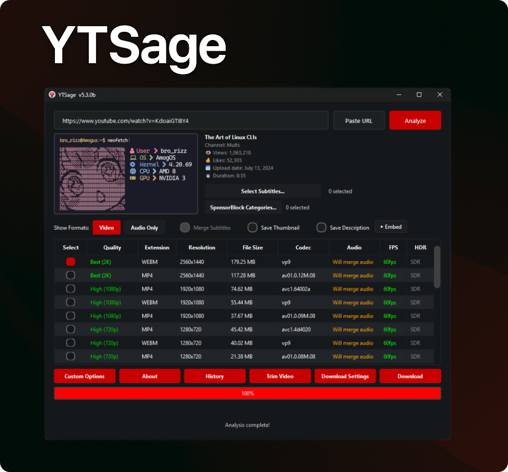
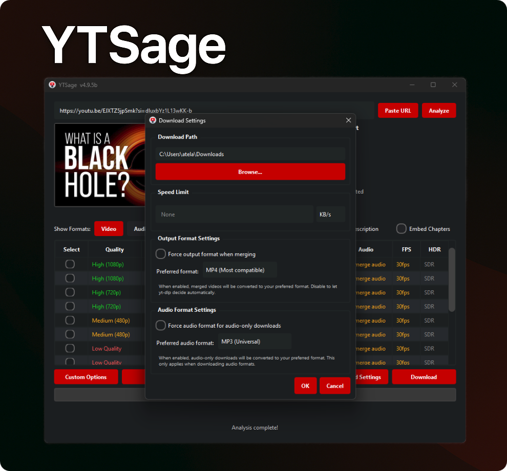
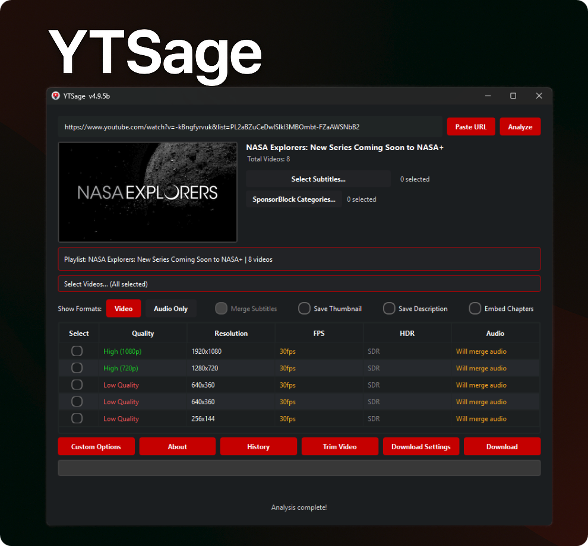
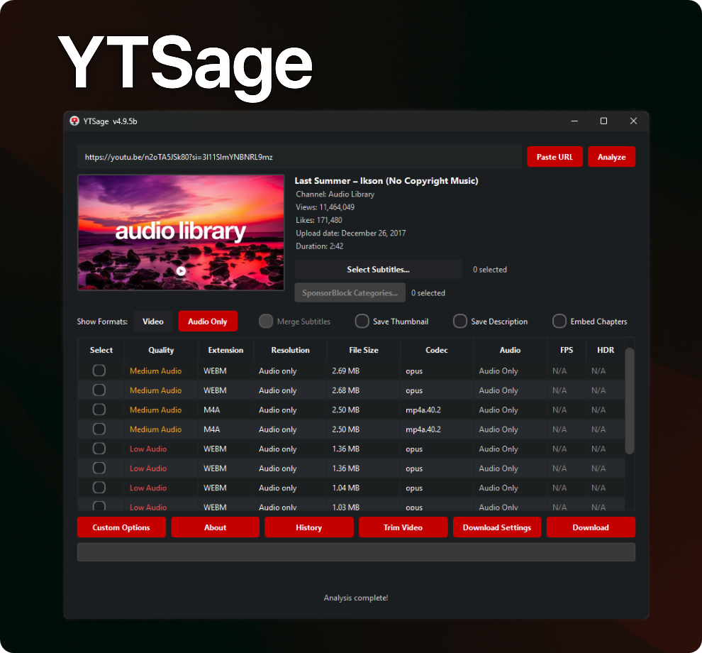
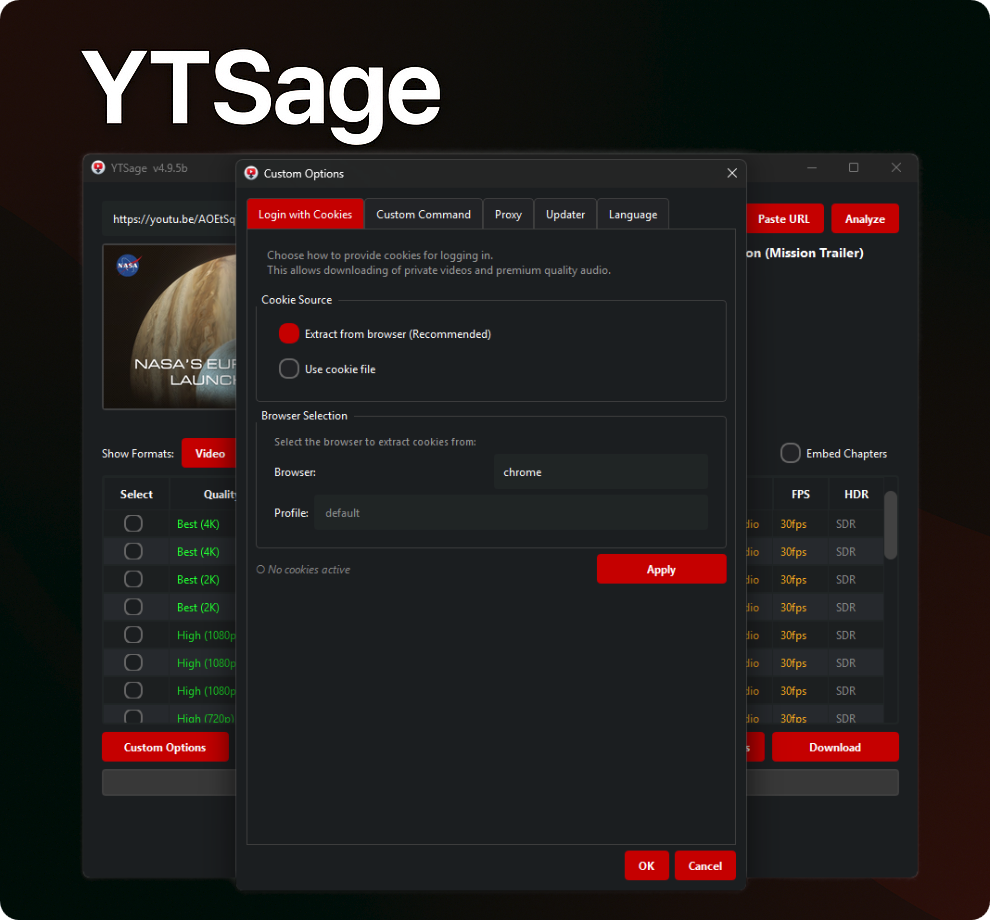
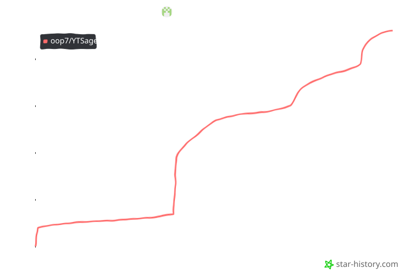

<div align="center">




[](https://www.python.org/downloads/)
[](https://pepy.tech/project/ytsage)
[](https://github.com/oop7/YTSage/releases)
[](https://opensource.org/licenses/MIT)
[](https://github.com/oop7/YTSage/releases)
[](https://github.com/oop7/YTSage/stargazers)
[](https://pypi.org/project/ytsage/)
[](https://github.com/sponsors/oop7)

**깔끔한 PySide6 인터페이스를 갖춘 모던 YouTube 다운로더.**  
원하는 화질로 동영상 다운로드, 오디오 추출, 자막 가져오기 등을 지원합니다.

### 🌍 README 언어

영어: [EN](../README.md)
| 아랍어: [AR](README.ar.md)
| 독일어: [DE](README.de.md)
| 스페인어: [ES](README.es.md)
| 프랑스어: [FR](README.fr.md)
| 힌디어: [HI](README.hi.md)
| 인도네시아어: [ID](README.id.md)
| 이탈리아어: [IT](README.it.md)
| 일본어: [JA](README.ja.md)
| 한국어: [KO](README.ko.md)
| 폴란드어: [PL](README.pl.md)
| 포르투갈어: [PT](README.pt.md)
| 러시아어: [RU](README.ru.md)
| 터키어: [TR](README.tr.md)
| 중국어: [ZH](README.zh.md)
| 페르시아어: [FA](README.fa.md)

<p align="center">
  <a href="#설치">설치</a> •
  <a href="#기능">기능</a> •
  <a href="#사용-방법">사용 방법</a> •
  <a href="#스크린샷">스크린샷</a> •
  <a href="#문제-해결">문제 해결</a> •
  <a href="#스폰서">스폰서</a> •
  <a href="#기여">기여</a>
</p>

</div>

---

<a id="왜-ytsage인가"></a>
## ❓ 왜 YTSage인가?

YTSage는 **간단하면서도 강력한 YouTube 다운로더**를 원하는 사용자를 위해 설계되었습니다. 다른 도구와 달리 다음을 제공합니다:

- 모던하고 깔끔한 PySide6 인터페이스
- 동영상, 오디오, 자막 원클릭 다운로드
- SponsorBlock, 자막 병합, 재생목록 선택 등 고급 기능
- yt-dlp가 지원하는 YouTube 외 사이트용 선택적 일반 모드
- 크로스 플랫폼 지원과 간편한 설치

<a id="기능"></a>
## ✨ 기능

<div align="center">

| 핵심 기능 | 고급 기능 | 추가 기능 |
|-----------------------------------|-----------------------------------------|------------------------------------|
| 🎥 형식 표 | 🚫 SponsorBlock 통합 | 🎞️ FPS/HDR 표시 |
| 🎵 오디오 추출 | 📝 자막 선택 및 병합 | 🔄 yt-dlp 자동 업데이트 |
| ✨ 간편한 UI | 💾 설명 및 썸네일 저장 | 🛠️ FFmpeg/yt-dlp/Deno 감지 |
| 📋 재생목록 지원 및 선택 | 🚀 속도 제한 | ⚙️ 사용자 지정 명령 |
| 📑 챕터 통합 | ✂️ 동영상 구간 자르기 | 🍪 쿠키 로그인 |
| 📜 다운로드 기록 | 🔄 릴리스 채널 선택 | 🌐 프록시 지원 |
| 🎚️ 오디오 형식 변환 | 🎬 동영상 형식 설정 | 🆙 내장 업데이터 탭 |
| 🌍 일반 모드 | 🔊 오디오 정규화 (EBU R128) | 🌍 16개 언어 로컬라이즈 |
| 💾 재생목록 내보내기 | ⚙️ 기본 화질 및 자막 | |
</div>

<a id="설치"></a>
## 🚀 설치

### ⚡ 빠른 설치 (권장)

PyPI로 YTSage를 설치합니다:

```bash
pip install ytsage
```

<details>
<summary>🔄 기존 설치 업데이트</summary>

```bash
pip install --upgrade ytsage
```

</details>

그다음 애플리케이션을 실행합니다:

```bash
ytsage
```

### 📦 빌드된 실행 파일

> [👉 최신 릴리스 다운로드](https://github.com/oop7/YTSage/releases/latest)

#### 🪟 Windows

| 형식 | 설명 |
|--------|-------------|
|  | 표준 설치 프로그램 |
|  | FFmpeg 포함 |
|  | 포터블 버전, 설치 불필요 |
|  | FFmpeg 포함 포터블 (ZIP) |

<details>
<summary>🛠️ 설치 단계</summary>

1. **EXE 설치 프로그램 (`.exe`)**: 파일을 더블클릭한 뒤 설치 마법사를 따릅니다.
2. **포터블 버전 (`.zip`)**: 원하는 위치에 압축을 풀고 `ytsage.exe`를 실행합니다.
3. **FFmpeg 포함**: 시스템에 FFmpeg가 없다면 FFmpeg가 포함된 버전을 선택하세요.
</details>

#### 🐧 Linux

| 형식 | 설명 |
|--------|-------------|
|  | Debian 패키지 |
|  | AppImage, 포터블 |
|  | RPM 패키지 |
|  | Flatpak 번들 |

<details>
<summary>🛠️ 설치 단계</summary>

- **DEB (`.deb`)**:
  ```bash
  sudo dpkg -i ytsage_*.deb
  sudo apt-get install -f # 필요 시 누락된 의존성 해결
  ```
- **RPM (`.rpm`)**:
  ```bash
  sudo rpm -i ytsage-*.rpm
  ```
- **AppImage (`.AppImage`)**:
  ```bash
  chmod +x YTSage-*.AppImage
  ./YTSage-*.AppImage
  ```
- **Flatpak**: Flathub 안내를 따르거나 다음을 실행합니다:
  ```bash
  flatpak install flathub io.github.oop7.ytsage
  ```
</details>

#### 🍎 macOS

| 형식 | 설명 |
|--------|-------------|
|  | Apple Silicon용 ZIP 앱 |
|  | Apple Silicon용 디스크 이미지 설치 프로그램 |

<details>
<summary>🛠️ 설치 단계</summary>

- **DMG 설치 프로그램 (`.dmg`)**: 더블클릭해 마운트한 뒤 `YTSage.app`을 응용 프로그램 폴더로 드래그합니다.
- **앱 아카이브 (`.zip`)**: ZIP을 풀고 `YTSage.app`을 응용 프로그램 폴더로 이동합니다.

*참고: "앱이 손상되었습니다" 오류가 나면 아래 macOS 문제 해결 섹션을 참고하세요.*
</details>

---

<details>
<summary>💻 소스에서 수동 설치</summary>

### 1. 저장소 클론

```bash
git clone https://github.com/oop7/YTSage.git
cd YTSage
```

### 2. 의존성 설치

#### ⚡ uv 사용

```bash
uv pip install .
```

#### 📦 또는 표준 pip 사용

```bash
pip install .
```

### 3. 애플리케이션 실행

```bash
python -m ytsage.main
```

</details>

<a id="스크린샷"></a>
## 📸 스크린샷

<div align="center">
<table>
  <tr>
    <td></td>
    <td></td>
  </tr>
  <tr>
    <td align="center"><em>다운로드 설정</em></td>
    <td align="center"><em>재생목록 다운로드</em></td>
  </tr>
  <tr>
    <td></td>
    <td></td>
  </tr>
  <tr>
    <td align="center"><em>오디오 형식</em></td>
    <td align="center"><em>사용자 지정 옵션</em></td>
  </tr>
</table>
</div>

<a id="사용-방법"></a>
## 📖 사용 방법

<details>
<summary>🎯 기본 사용</summary>

1. **YTSage 실행**
2. **YouTube URL 붙여넣기** (또는 "URL 붙여넣기" 버튼 사용)
3. **"분석" 클릭**
4. **포맷 선택:**
   - 비디오 다운로드는 `Video`
   - 오디오 추출은 `Audio`
> 💡 이제 오디오 섹션에서 여러 오디오 트랙을 선택하여 하나의 비디오로 병합할 수 있습니다. 비디오에 여러 언어 트랙을 결합하거나 여러 오디오 스트림을 함께 병합할 수 있습니다.
5. **옵션 선택:**
   - 자막 활성화 및 언어 선택
   - 자막 병합 활성화
   - 썸네일 저장
   - 스폰서 구간 제거
   - 설명 저장
   - 챕터 임베드 (챕터, 메타데이터, 썸네일)

6. **"다운로드" 클릭**

> 💡 기본 다운로드 디렉토리는 사용자의 "다운로드" 폴더입니다.

</details>

<details>
<summary>📋 재생목록 다운로드</summary>

1. **재생목록 URL 붙여넣기**
2. **"분석" 클릭**
3. **재생목록 선택기에서 비디오 선택 (선택 사항, 기본값은 전체)**
4. **원하는 포맷/화질 선택**
5. **"다운로드" 클릭**

> 💡 "다른 이름으로 재생목록 저장" 버튼을 클릭하여 재생목록 항목을 (`.txt`, `.csv`, `.m3u`, 또는 `.json`)으로 내보낼 수 있습니다.

</details>

<details>
<summary>🌍 YouTube 외 사이트용 일반 모드</summary>

Dailymotion, CBC Gem, TikTok 등 yt-dlp가 지원하는 사이트의 URL을 받으려면 일반 모드를 사용하세요.

사용 방법:

1. `다운로드 설정`을 엽니다.
2. `일반 모드`를 켭니다.
3. YouTube가 아닌 지원 동영상/재생목록 URL을 붙여넣습니다.
4. `분석`을 클릭합니다.
5. 형식을 고른 뒤 평소처럼 다운로드합니다.

참고:

- 일반 모드는 YTSage 내부 URL 검증만 바꿉니다. 대상 사이트는 설치된 yt-dlp 버전에서 지원되어야 합니다.
- 일부 사이트는 쿠키, 로그인 세션, 프록시 또는 추가 yt-dlp 인수가 필요할 수 있습니다.
- 사이트가 실패하면 이슈를 올리기 전에 내장 업데이터 탭에서 yt-dlp를 먼저 업데이트하세요.

</details>

<details>
<summary>🧰 미디어 및 다운로드 옵션</summary>

- **자막 옵션:** 언어를 필터링하고 자막을 동영상 파일에 포함합니다.
- **자막 병합:** 자막을 동영상에 병합해 하드코딩(구워 넣기) 자막으로 만듭니다.
- **설명 저장:** 동영상 설명을 텍스트 파일로 저장합니다.
- **썸네일 저장:** 동영상 썸네일을 이미지 파일로 저장합니다.
- **챕터 포함:** 호환 플레이어용 챕터 마커를 메타데이터로 포함합니다.
- **스폰서 구간 제거:** SponsorBlock으로 스폰서 구간을 제거합니다.
- **동영상 자르기:** `HH:MM:SS` 형식으로 시간 범위를 지정해 일부만 다운로드합니다.

</details>

<details>
<summary>⚙️ 출력 및 파일 설정</summary>

- **속도 제한:** 다운로드 속도를 제한합니다. 예: `500K` = 500 KB/s.
- **다운로드 경로 저장:** 이후 다운로드용 기본 경로를 저장합니다. **다운로드 설정 → 다운로드 경로**.
- **기본 동영상 해상도:** 자동 선택용 기본 해상도를 설정합니다 (예: 1080p, 720p). **다운로드 설정 → 기본 동영상 해상도**.
- **기본 자막 언어:** 자동 선택용 기본 자막 언어를 설정합니다 (쉼표 구분, 예: `ko,en`). **다운로드 설정 → 기본 자막 언어**.
- **출력 파일명 형식:** `%(title)s`, `%(uploader)s`, `%(playlist_index)s`, `%(resolution)s` 등 변수로 파일명을 맞춤 설정합니다. **다운로드 설정 → 파일명 형식**.
- **출력 형식 강제:** 다운로드를 `mp4`, `webm`, `mkv` 등 특정 컨테이너로 강제합니다. **다운로드 설정 → 출력 형식 설정**.
- **오디오 형식 변환:** 오디오 전용 다운로드를 `AAC`, `MP3`, `FLAC`, `WAV`, `Opus`, `M4A`, `Vorbis`, `Best` 등으로 변환합니다. **다운로드 설정 → 오디오 형식 설정**.
- **오디오 정규화:** EBU R128로 오디오 전용 다운로드의 음량을 표준화합니다.
- **동시 연결:** 파일을 여러 조각으로 동시에 받아 속도를 크게 높입니다. **다운로드 설정 → 일반 → 동시 연결** (기본값 1, IP 제한을 피하려면 최대 8–10 권장).

</details>

<details>
<summary>🌐 접근 및 네트워크</summary>

- **쿠키로 로그인:** 쿠키로 YouTube에 로그인해 비공개 콘텐츠에 접근합니다.
  사용 방법:
  1. **권장:** 앱 내장 `브라우저에서 쿠키 추출` 옵션을 쓰고 브라우저(및 선택적으로 프로필)를 선택합니다.
  2. 또는 수동 추출:
     a. [cookie-editor](https://github.com/moustachauve/cookie-editor?tab=readme-ov-file) 같은 확장으로 브라우저 쿠키를 내보냅니다
     b. Netscape 형식으로 쿠키를 복사합니다
     c. `cookies.txt` 파일을 만들어 붙여넣습니다
     d. 앱에서 `cookies.txt` 파일을 선택합니다
- **프록시 지원:** 다운로드에 프록시 서버를 사용합니다. 예: `http://<proxy-server>:<port>`
- **일반 모드:** yt-dlp가 지원하는 YouTube 외 사이트 분석/다운로드를 허용합니다. **다운로드 설정 → 일반 모드**에서 켭니다.

</details>

<details>
<summary>🛠️ 도구 및 유지관리</summary>

- **사용자 지정 명령:** 명령줄 인수로 고급 yt-dlp 기능을 사용합니다.
- **업데이터 탭:** 사용자 지정 옵션에서 내장 업데이트 도구를 한곳에서 관리합니다:
  - **yt-dlp 업데이트:** 업데이트 확인 및 안정판/나이틀리 채널 전환
  - **FFmpeg 버전 확인:** FFmpeg 버전 확인 및 설치 가이드 열기
  - **Deno 업데이트:** Deno 런타임 확인 및 업데이트
- **FFmpeg/yt-dlp/Deno 감지:** 정보 대화상자에서 경로와 버전을 자동 감지합니다.
- **다운로드 기록:** **기록** 버튼에서 썸네일과 상태와 함께 과거 다운로드를 봅니다.
- **알림 소리 끄기:** **다운로드 설정 → 일반 → 알림 소리**에서 완료 알림 소리를 끌 수 있습니다.

</details>

<details>
<summary>🌍 로컬라이즈</summary>

YTSage는 전 세계 사용자를 위해 **16개 언어**를 지원합니다. **사용자 지정 옵션 → 언어**에서 선호 언어를 선택하세요.

### 지원 언어

| 언어 | 코드 | 언어 | 코드 |
|----------|------|----------|------|
| 🇺🇸 영어 | `en` | 🇪🇸 스페인어 | `es` |
| 🇸🇦 아랍어 | `ar` | 🇫🇷 프랑스어 | `fr` |
| 🇩🇪 독일어 | `de` | 🇮🇳 힌디어 | `hi` |
| 🇮🇩 인도네시아어 | `id` | 🇮🇹 이탈리아어 | `it` |
| 🇯🇵 일본어 | `ja` | 🇰🇷 한국어 | `ko` |
| 🇵🇱 폴란드어 | `pl` | 🇧🇷 포르투갈어 | `pt` |
| 🇷🇺 러시아어 | `ru` | 🇹🇷 터키어 | `tr` |
| 🇨🇳 중국어 | `zh` | 🇮🇷 페르시아어 | `fa` |

### README 번역

| 언어 | 파일 | 언어 | 파일 |
|----------|------|----------|------|
| 🇺🇸 영어 | [README.md](../README.md) | 🇪🇸 스페인어 | [README.es.md](README.es.md) |
| 🇸🇦 아랍어 | [README.ar.md](README.ar.md) | 🇫🇷 프랑스어 | [README.fr.md](README.fr.md) |
| 🇩🇪 독일어 | [README.de.md](README.de.md) | 🇮🇳 힌디어 | [README.hi.md](README.hi.md) |
| 🇮🇩 인도네시아어 | [README.id.md](README.id.md) | 🇮🇹 이탈리아어 | [README.it.md](README.it.md) |
| 🇯🇵 일본어 | [README.ja.md](README.ja.md) | 🇰🇷 한국어 | [README.ko.md](README.ko.md) |
| 🇵🇱 폴란드어 | [README.pl.md](README.pl.md) | 🇧🇷 포르투갈어 | [README.pt.md](README.pt.md) |
| 🇷🇺 러시아어 | [README.ru.md](README.ru.md) | 🇹🇷 터키어 | [README.tr.md](README.tr.md) |
| 🇨🇳 중국어 | [README.zh.md](README.zh.md) | 🇮🇷 페르시아어 | [README.fa.md](README.fa.md) |

> 💡 **번역에 기여하고 싶으신가요?** [기여](#기여) 섹션을 참고해 더 많은 언어를 추가해 주세요!

</details>

<a id="문제-해결"></a>
## 🛠️ 문제 해결

<details>
<summary>클릭하여 자주 있는 문제와 해결 방법 보기</summary>

- **형식 표가 나타나지 않음:** yt-dlp를 최신 버전으로 업데이트하고 나이틀리로 전환해 보세요.
- **다운로드 실패:** 인터넷 연결을 확인하고 동영상을 사용할 수 있는지 확인하세요.
- **특정 다운로드 오류:**
  - **비공개 동영상:** 쿠키 인증으로 비공개 콘텐츠에 접근하세요.
  - **연령 제한 콘텐츠:** YouTube 계정으로 로그인하세요.
  - **지역 차단 동영상:** VPN으로 지역 제한을 우회하는 것을 고려하세요.
  - **삭제된 동영상:** YouTube에서 더 이상 사용할 수 없습니다.
  - **라이브 스트림:** 방송 중에는 다운로드할 수 없습니다. 방송이 끝난 뒤 시도하세요.
  - **네트워크 오류:** 인터넷 연결을 확인한 뒤 다시 시도하세요.
  - **잘못된 URL:** URL이 올바르고 지원 플랫폼인지 확인하세요.
  - **프리미엄 콘텐츠:** YouTube Premium 구독이 필요합니다.
  - **저작권 차단:** 저작권 제한으로 콘텐츠가 차단되었습니다.
- **다운로드 후 동영상과 오디오 파일이 분리됨:** FFmpeg가 없거나 감지되지 않을 때 발생합니다. 고화질 스트림 병합에 FFmpeg가 필요합니다.
  - **해결:** FFmpeg를 설치하고 시스템 PATH에서 접근 가능하게 하세요. Windows에서는 FFmpeg가 포함된 `YTSage-v<version>-ffmpeg.exe`를 받는 것이 가장 쉽습니다.

---

#### 🛡️ Windows Defender / 백신 경고

일부 백신 소프트웨어가 `.exe` 파일을 오탐(false positive)으로 표시할 수 있습니다. 패키징된 앱의 **알려진 제한**입니다.

**원인:**
- 백신 휴리스틱이 패키징된 실행 파일을 의심 대상으로 잘못 분류할 수 있습니다.

**안전한 대안:**
- ✅ **pip 설치 사용:** `pip install ytsage` (권장)
- ✅ **소스에서 빌드:** 이 [가이드](../.github/CI_CD_README.md)를 따릅니다
- ✅ 백신 소프트웨어에서 앱을 **허용 목록에 추가**

#### 🍎 macOS: "앱이 손상되어 열 수 없습니다"
macOS Sonoma 이상에서 이 오류가 나면 quarantine 속성을 제거해야 합니다.

1.  **터미널**을 엽니다 (Spotlight로 검색).
2.  다음 명령을 입력하되 **아직 Enter는 누르지 마세요.** 끝 공백을 포함하세요:
    ```bash
    xattr -d com.apple.quarantine 
    ```
3.  Finder에서 `YTSage.app`을 터미널 창으로 **드래그 앤 드롭**합니다. 올바른 경로가 자동으로 붙습니다.
4.  **Enter**를 눌러 실행합니다.
5.  **YTSage.app**을 다시 열어 보세요.

---

#### **설정 위치 (고급)**
- **Windows:** `%LOCALAPPDATA%\YTSage`
- **macOS:** `~/Library/Application Support/YTSage`
- **Linux:** `~/.local/share/YTSage`

</details>

<a id="스폰서"></a>
## 💖 스폰서

YTSage가 시간을 아끼게 해 주었다면 프로젝트 후원을 고려해 주세요. 후원은 개발 시간, 전 플랫폼 테스트, 향후 개선에 사용됩니다.

- GitHub Sponsors: https://github.com/sponsors/oop7
- Buy Me a Coffee: https://www.buymeacoffee.com/oop7
- 직접 계좌 이체 / SWIFT: 이메일 [`oop7_support@proton.me`](mailto:oop7_support@proton.me)로 문의하세요

[](https://github.com/sponsors/oop7)


<a id="기여"></a>
## 👥 기여

<details>
<summary>기여 가이드라인을 펼치려면 클릭하세요</summary>

기여를 환영합니다! 다음처럼 도울 수 있습니다:

1. 🍴 저장소를 포크합니다
2. 🌿 기능 브랜치를 만듭니다:
  ```bash
  git checkout -b feature/AmazingFeature
  ```
3. 💾 변경을 커밋합니다:
  ```bash
  git commit -m 'Add some AmazingFeature'
  ```
4. 📤 브랜치에 푸시합니다:
  ```bash
  git push origin feature/AmazingFeature
  ```
5. 🔄 Pull Request를 엽니다

### 🌍 번역 기여

- 해당 언어 README를 업데이트합니다 (예: `readme-translations/README.ko.md`)
- `ytsage/languages/<code>.json`을 편집해 앱 문자열을 동기화합니다
- 언어가 없다면 `README.md`를 기준으로 `readme-translations/README.<code>.md`를 만드세요

</details>

<details>
<summary>📂 프로젝트 구조</summary>

## YTSage - 프로젝트 구조

이 문서는 YTSage의 정리된 폴더 구조를 설명합니다.

### 📁 프로젝트 구조

```
YTSage/
├── 📁 .github/                   # GitHub 설정
│   ├── 📁 ISSUE_TEMPLATE/         # 이슈 템플릿
│   │   └── 🐛-bug-report.md       # 버그 리포트 템플릿
│   ├─── 📁 workflows/              # GitHub Actions 워크플로
│   │   ├── build-linux.yml        # Linux 빌드
│   │   ├── build-macos.yml        # macOS 빌드
│   │   │── build-windows.yml      # Windows 빌드
|   |   └── release-all.yml          # 마스터 릴리스
│   └── 📄 CI_CD_README.md        # CI/CD 문서
├──  📁 branding/                 # 브랜딩 자산 (스크린샷, SVG)
│   ├── 📁 icons/                 # 앱 아이콘
│   ├── 📁 screenshots/           # 문서용 스크린샷
│   └── 📁 svg/                   # SVG 자산
├── 📄 LICENSE                    # 라이선스
├── 📄 pyproject.toml             # 프로젝트 메타데이터 및 의존성
├── 📄 README.md                  # 프로젝트 문서
├── 📄 requirements.txt           # Python 의존성 (dev)
└── 📁 ytsage/                    # 소스 코드 패키지
    ├── 📁 assets/                # 런타임 자산
    │   ├── 📁 Icon/              # 앱 아이콘
    │   └── 📁 sound/             # 사운드 파일
    ├── 📁 languages/             # 로컬라이즈 파일
    │   ├── 📄 ar.json            # 아랍어
    │   ├── 📄 de.json            # 독일어
    │   ├── 📄 en.json            # 영어
    │   ├── 📄 ko.json            # 한국어
    │   └── ...                   # 기타 언어
    ├── 📁 core/                  # 핵심 비즈니스 로직
    │   ├── 📄 __init__.py
    │   ├── 📄 ytsage_deno.py     # Deno 통합
    │   ├── 📄 ytsage_downloader.py # 다운로드 기능
    │   ├── 📄 ytsage_ffmpeg.py   # FFmpeg 통합
    │   ├── 📄 ytsage_utils.py    # 유틸리티
    │   └── 📄 ytsage_yt_dlp.py   # yt-dlp 통합
    ├── 📁 gui/                   # UI 컴포넌트
    │   ├── 📄 __init__.py
    │   ├── 📄 ytsage_gui_main.py # 메인 창
    │   └── 📁 ytsage_gui_dialogs/ # 대화상자
    ├── 📁 utils/                 # 유틸리티 모듈
    │   ├── 📄 __init__.py
    │   ├── 📄 ytsage_config_manager.py # 설정 관리
    │   └── 📄 ytsage_logger.py   # 로깅
    ├── 📄 __init__.py
    └── 📄 main.py
```

</details>

## ⭐️ 스타 히스토리

<div align="center">

[](https://github.com/oop7/YTSage/stargazers)

</div>

## 📜 라이선스

이 프로젝트는 MIT 라이선스에 따라 라이선스가 부여됩니다. 자세한 내용은 [LICENSE](../LICENSE) 파일을 참조하세요.

## 🙏 감사 인사

<div align="left">

<p>개선 사항을 제안하거나 버그를 신고하기 위해 이슈를 열어 이 프로젝트에 기여해 주신 모든 분들께 감사드립니다</p>
<p>이 프로젝트를 지원해 주신 최초 및 주요 기부자 <a href="https://github.com/bastik-1001"><strong>@bastik-1001</strong></a> 님과 <a href="https://github.com/dj23me"><strong>@dj23me</strong></a> 님께 특별히 감사드립니다 ❤️</p>


<table>
    <tr class="section"><th colspan="2">핵심 구성 요소</th></tr>
    <tr>
        <td width="35%"><a href="https://github.com/yt-dlp/yt-dlp">yt-dlp</a></td>
        <td>다운로드 엔진</td>
    </tr>
    <tr>
        <td><a href="https://ffmpeg.org/">FFmpeg</a></td>
        <td>미디어 처리</td>
    </tr>
    <tr>
        <td><a href="https://deno.com/">Deno</a></td>
        <td>yt-dlp 플러그인용 런타임</td>
    </tr>
    <tr class="section"><th colspan="2">라이브러리 및 프레임워크</th></tr>
    <tr>
        <td><a href="https://wiki.qt.io/Qt_for_Python">PySide6</a></td>
        <td>GUI 프레임워크</td>
    </tr>
    <tr>
        <td><a href="https://python-pillow.org/">Pillow</a></td>
        <td>이미지 처리</td>
    </tr>
    <tr>
        <td><a href="https://requests.readthedocs.io/">requests</a></td>
        <td>HTTP 요청</td>
    </tr>
    <tr>
        <td><a href="https://packaging.python.org/">packaging</a></td>
        <td>버전/패키지 관리</td>
    </tr>
    <tr>
        <td><a href="https://python-markdown.github.io/">markdown</a></td>
        <td>마크다운 렌더링</td>
    </tr>
    <tr>
        <td><a href="https://github.com/Delgan/loguru">loguru</a></td>
        <td>로깅</td>
    </tr>
    <tr class="section"><th colspan="2">자산 및 기여자에 대한 감사</th></tr>
    <tr>
        <td><a href="https://github.com/bastik-1001">@bastik-1001</a></td>
        <td>최초 및 주요 기부자 지원</td>
    </tr>
    <tr>
        <td><a href="https://pixabay.com/sound-effects/new-notification-09-352705/">New Notification 09 by Universfield</a></td>
        <td>알림 소리</td>
    </tr>
    <tr>
        <td><a href="https://github.com/viru185">viru185</a></td>
        <td>코드 기여자</td>
    </tr>
</table>

</div>

## ⚠️ 면책 조항

이 도구는 개인적인 용도로만 사용해야 합니다. YouTube의 서비스 약관 및 콘텐츠 제작자의 권리를 준수해 주세요.

---

<div align="center">

Made with ❤️ by [oop7](https://github.com/oop7)

</div>
